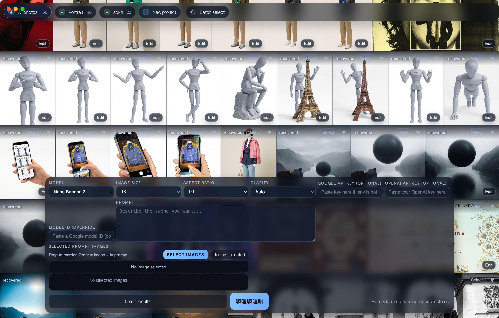

# Photo Foundry

Photo Foundry is a local-first macOS workspace for generating and organizing images across multiple AI models. It includes multi-reference prompts, generation history, projects, favorites, trash/restore, model cost tracking, and a responsive photo wall.

## Privacy

- API keys remain on the local machine.
- Generated images, prompts, projects, usage data, and notes are stored locally.
- Runtime data, `.env`, builds, and personal media are excluded from Git.
- This repository contains the application framework only. It contains no user generations or API credentials.

## Supported providers

- Google Gemini image models
- OpenAI image models

Availability depends on the models enabled for your provider account.

## Run locally

Requirements: Node.js 18 or newer and macOS.

```bash
npm install
npm start
```

Enter API keys in the app interface, or create `.env` from `.env.example`.

## Build for macOS

```bash
npm run dist:mac
```

The unsigned DMG is written to `dist/`. For public distribution, configure Apple Developer signing and notarization.

## Local data

The packaged app stores runtime data under:

```text
~/Library/Application Support/photo-foundry/
~/.photo-foundry/
```

Deleting or replacing the app does not automatically delete this data.

## Screenshots

### Photo wall and projects


### Prompt workspace


